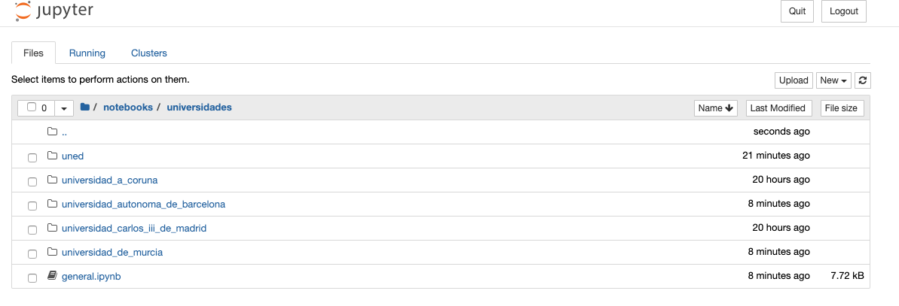

# Proyecto DAGU: Datos Abiertos de Grados Universitarios

> Nota: este proyecto está en desarrollo

## Motivación

Este proyecto tiene como objetivo recopilar información normalizada de los distintos grados universitarios oficiales de universidades públicas españolas. Es posible que se amplíe el número de universidades, pero inicialmente partiremos con estas. A día de hoy, existen multitud de grados distintos pero con un temario similar, y es muy complicado y costoso poder comparar los distintos grados. Con esta información, se pueden crear herramientas para visualizar y analizar los datos de manera que, por ejemplo, puedan ayudar a futuros estudiantes a elegir qué carrera estudiar.

Debido a la gran cantidad de grados que existen, para hacer una prueba inicial, se está comenzando por los [grados relacionados con la Ingeniería Informática y las Ciencias de la Computación.](universidades/grados_informatica/index.md)

> Actualmente, la parte de visualización se realizara como entrega final de la asignatura de [Visualización de Datos](http://portal.uned.es/portal/page?_pageid=93,69878406&_dad=portal&_schema=PORTAL&idAsignatura=31110060&idTitulacion=311001) del [Máster en Ingeniería y Ciencia de Datos de la UNED](http://portal.uned.es/portal/page?_pageid=93,69878428&_dad=portal&_schema=PORTAL)

## Aclaraciones

Este trabajo no pretende clasificar ningún grado universitario, universidad o facultad, entre otros, según ningún ranking o ningún tipo de criterio. Sólo pretende crear un directorio con información **unificada** de los distintos grados universitarios.

## ¿No existen ya otras herramientas?

Sí, existen herramientas como:

- El buscador de estudios de [qué estudiar](https://www.queestudiar.org/buscador-de-estudios/)
- El buscador de estudios de [emagister](https://www.emagister.com/universidades/)
- El buscador de estudios de [universia](https://www.universia.es/estudios)

Estas herramientas también son muy útiles y recomendables. No obstante, la intención es crear, poco a poco, un repositorio de datos **abiertos** con información más completa, como por ejemplo, el temario por asignatura para poder compararlas.

## ¿Cómo se recogen los datos?

Los datos se obtienen única y exclusivamente de las webs oficiales de cada una de las universidades.

* [Lista de Universidades Españolas](universidades/lista-universidades-publicas.md)

## Cómo utilizarlo

### Utilizar Jupyter Notebook para la recogida de datos

Para cada Universidad se crea un notebook con los pasos necesarios para obtener los datos de un grado. Puedes abrir esos notebooks en una herramienta online o trabajar directamente en un entorno local.

Siguiendo los siguientes pasos puedes utilizarlo en local (necesitas Python 3):

1. Clona el repositorio

2. Crea un entorno virtual:

Si no tienes instalado `pipenv`:

```
pip install pipenv
```

Desde el directorio raíz:

```
pipenv -venv
```

3. Instala los paquetes necesarios

```
pipenv install
```

4. Levanta Jupyter Notebook

```
jupyter notebook
```

5. Una vez en Jupyter, entra en `notebooks > universidades`




## Próximos pasos

Una vez se obtenga una muestra sobre la que trabajar, se creará una página web muy simple para evaluar cómo visualizar los datos y efectuar comparativas entre los grados universitarios.

Mientras tanto, seguiremos recopilando datos y mejorando este repositorio.

## ¿Quieres colaborar?

Este es un proyecto Open Source y cualquier colaboración es bienvenida, desde feedback, apertura de issues, sugerencias de cambio, o aportaciones al repositorio.

> Nota: se está trabajando en un código de conducta que se publicará en este mismo respositorio. Mientras tanto, puedes echar un vistazo al de [Microsoft](https://opensource.microsoft.com/codeofconduct/)